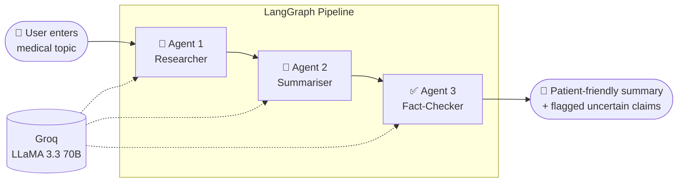

# 🏥 Medical Research Assistant — Multi-Agent System


🚀 **Live App:** [Try it here](https://medical-research-agent-3mbhgune6spud5lszhhvqs.streamlit.app) *(if the app is asleep, click wake up and wait ~30s)*

A multi-agent AI system that researches any medical topic using **3 specialized agents working in sequence**: one gathers information, one makes it readable, and one checks it before the user sees it.

<!-- TODO: add a screenshot of the app showing a real result -->
<!--  -->

---

## 🤔 Why Multi-Agent?

A single LLM call asked to "research, simplify and verify" does all three jobs poorly, and it has no reason to question its own output.

Splitting the work into separate agents means:
- each agent has **one focused job** and one focused prompt
- the **Fact-Checker reviews output it didn't write**, so it's more likely to catch errors
- each step can be **inspected, tested and improved independently**

📝 I wrote about this decision: [Why I Stopped Using Single LLM Calls and Built a 3-Agent Medical Research Pipeline with LangGraph](https://medium.com/@bhardwajpreeti357/why-i-stopped-using-single-llm-calls-and-built-a-3-agent-medical-research-pipeline-with-langgraph-713fecf660b1)

---

## 🏗️ Architecture



| Agent | Job |
|---|---|
| 🔬 **Researcher** | Gathers comprehensive information on the topic |
| 📝 **Summariser** | Rewrites the research in clear, patient-friendly language |
| ✅ **Fact-Checker** | Validates claims and flags anything uncertain |

The pipeline is a **LangGraph state graph**: each agent reads from and writes to a shared state, so every agent's output is passed cleanly to the next.

---

## 🛠️ Tech Stack

| Layer | Tool |
|---|---|
| Agent orchestration | LangGraph |
| LLM | Groq — LLaMA 3.3 70B |
| UI | Streamlit |
| Containerisation | Docker |
| Language | Python |

---

## 📁 Project Structure

```
medical-research-agent/
├── agents/            # Researcher, Summariser and Fact-Checker agents
├── graph.py           # LangGraph pipeline wiring the agents together
├── app.py             # Streamlit UI
├── Dockerfile
├── requirements.txt
└── .gitignore
```

---

## 🚀 Run Locally

**1. Clone the repo**
```bash
git clone https://github.com/mistyvisty/medical-research-agent.git
cd medical-research-agent
```

**2. Create a virtual environment**
```bash
python -m venv venv
# Windows
venv\Scripts\activate
# macOS / Linux
source venv/bin/activate
```

**3. Install dependencies**
```bash
pip install -r requirements.txt
```

**4. Add your Groq API key**, which you can get free at [console.groq.com](https://console.groq.com). Create a `.env` file:
```
GROQ_API_KEY=your_key_here
```

**5. Run the app**
```bash
streamlit run app.py
```

### 🐳 Or run with Docker
```bash
docker build -t medical-research-agent .
docker run -p 8501:8501 --env-file .env medical-research-agent
```
Then open http://localhost:8501

---

## ⚠️ Limitations

- Answers come from the LLM's training knowledge, not live medical databases, so very recent research may be missing
- The Fact-Checker is also an LLM, so it reduces errors but can't guarantee accuracy
- Not a substitute for professional medical advice

## 🔮 Future Improvements

- Ground the Researcher in real sources (e.g. PubMed) using RAG, with citations
- Add an evaluation set to measure how often the Fact-Checker catches incorrect claims
- Let the Fact-Checker send weak answers back to the Researcher for a retry loop

---

## ⚠️ Disclaimer

This tool is for **informational purposes only**. Always consult a qualified doctor for medical advice.

## 👩‍💻 Built By

**Preeti Bhardwaj** — [GitHub](https://github.com/mistyvisty) · [Medium](https://medium.com/@bhardwajpreeti357)
